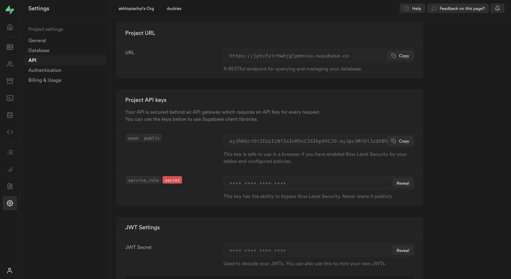
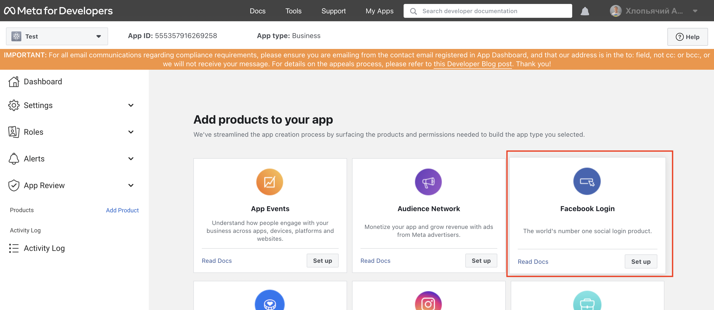
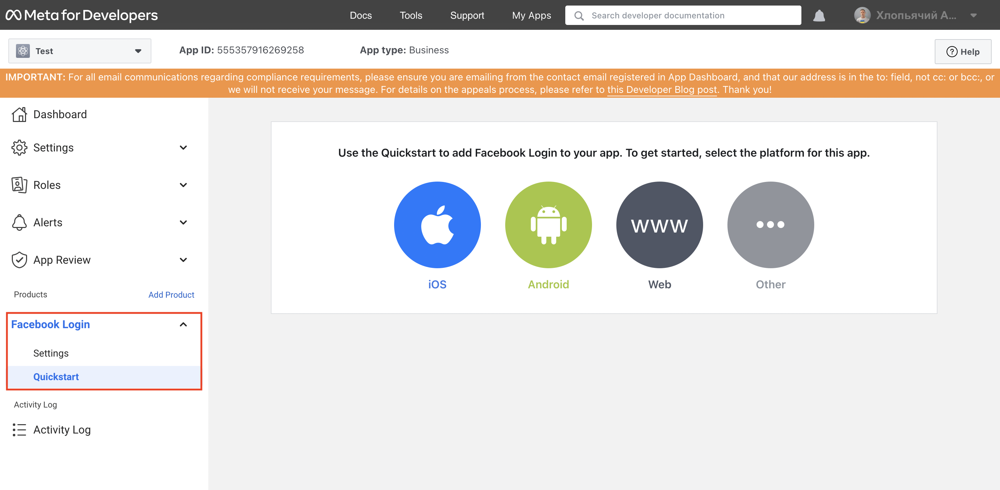
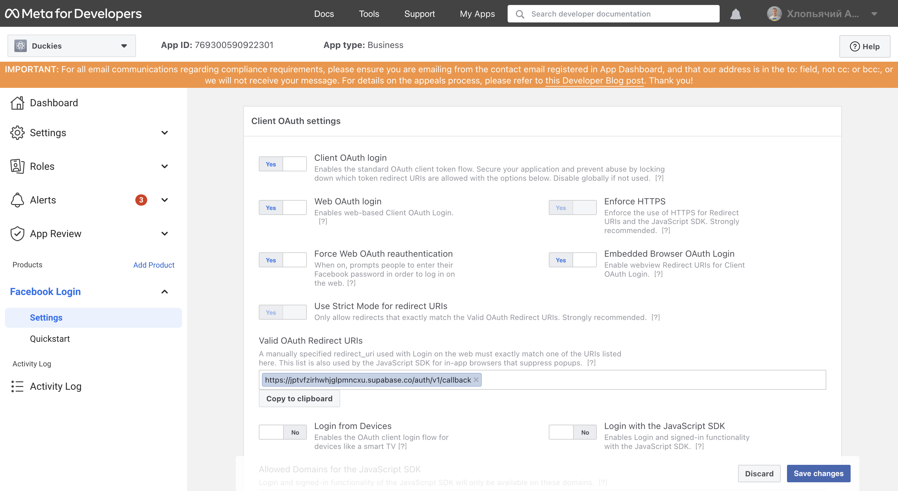
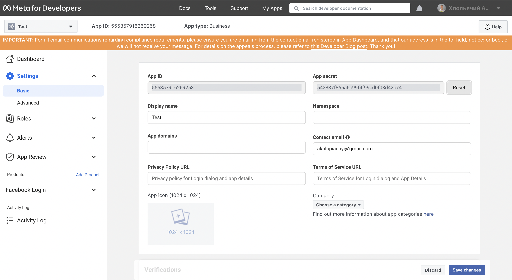

# How to connect Facebook auth?

To enable Facebook Auth for your project, you need to set up a Facebook OAuth application and add the application credentials to your Supabase Dashboard.

## Overview
Setting up Facebook logins for your application consists of 3 parts:

- Create and configure a Facebook Application on the [Facebook Developers Site](https://developers.facebook.com/)
- Add your Facebook keys to your [Supabase Project](https://app.supabase.com/)
- Add the login code to your Supabase JS Client App (already done by developers team)

### Access your Facebook Developer account

- Go to [developers.facebook.com](https://developers.facebook.com/)
- Click on `Log In` at the top right to log in


#### Create a Facebook App

1. Click on `My Apps` at the top right.
2. Click `Create App` near the top right.
3. Select your app type and click `Continue` (Duckies has type 'Business').
4. Fill in your app information, then click `Create App`.
5. This should bring you to the screen: Add Products to Your App. (Alternatively you can click on Add Product in the left sidebar to get to this screen.)

#### Find your callback URI

The next step requires a callback URI, which looks like this:
```https://<project-ref>.supabase.co/auth/v1/callback```

- Go to your [Supabase Project Dashboard](https://app.supabase.com/);
- Click on the `Settings` icon at the bottom of the left sidebar;
- Click on `API` in the list;
- Under Config / URL you'll find your API URL, you can click `Copy` to copy it to the clipboard;
- Now just add `/auth/v1/callback` to the end of that to get your full OAuth Redirect URI.



#### Set up FaceBook Login for your Facebook App
From the `Add Products to your App` screen:

- Click `Setup` under Facebook Login


- Skip the Quickstart screen, instead, in the left sidebar, click `Settings` under `Facebook Login`


- Enter your callback URI under `Valid OAuth Redirect URIs` on the `Facebook Login Settings page`
- Enter this in the `Valid OAuth Redirect URIs` box

- Click Save Changes at the bottom right

From the `App Review -> Permissions and Features` screen:
- Click the button Request Advanced Access on the right side of public_profile and email

#### Copy your Facebook App ID and Secret
- Click Settings / Basic in the left sidebar

- Copy your App ID from the top of the Basic Settings page
- Under App Secret click Show then copy your secret
- Make sure all required fields are completed on this screen.

#### Enter your Facebook App ID and Secret into your Supabase Project
- Go to your [Supabase Project Dashboard](https://app.supabase.com/);
- In the left sidebar, click the `Authentication` icon (near the top)
- Click `Settings` from the list to go to the `Authentication Settings` page
- Enter the final (hosted) URL of your app under `Site URL` (this is important)
- Under `External OAuth Providers` turn `Facebook Enabled` to ON
- Enter your `Facebook client ID` and `Facebook secret` saved in the previous step
- Click `Save`

Usefull links:
- [Supabase Authentication: Setting up Facebook Auth](https://youtu.be/EbV746pWDas)

