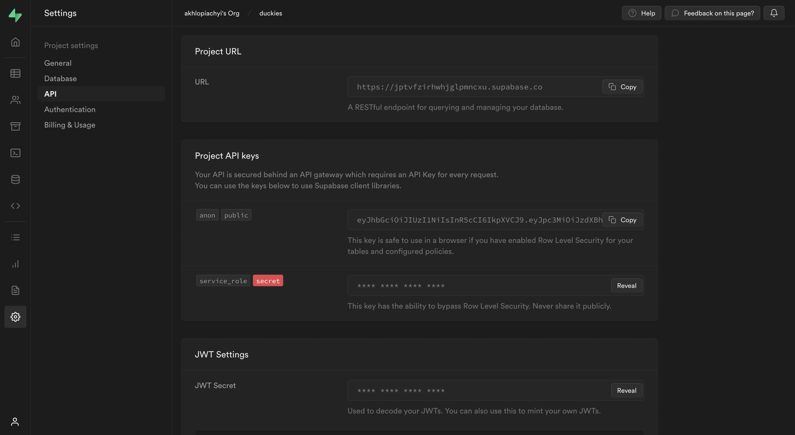

# How to connect Twitter auth?

To enable Google Auth for your project, you need to set up a Google OAuth application and add the application credentials to your Supabase Dashboard.

## Overview
Setting up Google logins for your application consists of 3 parts:

- Create and configure a Twitter Project and App on the [Twitter Developer Dashboard](https://developer.twitter.com/en/portal/dashboard);
- Add your Twitter `API Key` and `API Secret Key` to your [Supabase Project](https://app.supabase.com/);
- Add the login code to your Supabase JS Client App (already done by developers team).

## Steps

#### Access your Twitter Developer account

- Go to [developer.twitter.com](https://developer.twitter.com/en);
- Click on `Sign in` at the top right to log in.


#### Find your callback URI

The next step requires a callback URI, which looks like this:
```https://<project-ref>.supabase.co/auth/v1/callback```

- Go to your [Supabase Project Dashboard](https://app.supabase.com/);
- Click on the `Settings` icon at the bottom of the left sidebar;
- Click on `API` in the list;
- Under Config / URL you'll find your API URL, you can click `Copy` to copy it to the clipboard;
- Now just add `/auth/v1/callback` to the end of that to get your full OAuth Redirect URI.


#### Create a Twitter OAuth app and take API KEY and API SECRET KEY

- Click `Developer Portal` in header


- Go to `Projects & Apps` in sidebar


- Click `+ Create Project`.
- - Enter your project name, click `Next`.
- - Select your use case, click `Next`.
- - Enter a description for your project, click `Next`.
- - Enter a name for your app, click `Complete`.
- - Copy and save your `API Key` (this is your client_id).
- - Copy and save your `API Secret Key` (this is your client_secret).


#### Enabling Twitter auth in Duckies App

- Go to the `App Settings` of your application


- Scroll down and click on `Set up` button under the `User authentication settings`


- Enable `OAuth 1.0a` and `Request email from users` checkboxes and fill all required the data on this page


- Click `Save`.

#### Enter your Twitter credentials into your Supabase Project

- Go to your [Supabase Project Dashboard](https://app.supabase.com/);
- In the left sidebar, click the `Authentication` icon (near the top);
- Click `Settings` from the list to go to the `Authentication Settings` page;
- Enter the final (hosted) URL of your app under `Site URL` (this is important);
- Under `External OAuth Providers` turn `Twitter Enabled` to ON;
- Enter your `API Key` (`client_id`) and `API Secret Key` (`client_secret`) saved in the previous step;
- Click `Save`.

Usefull links:
- [Supabase Authentication: Setting up Twitter Auth](https://youtu.be/z1rWsRb4PDw)
